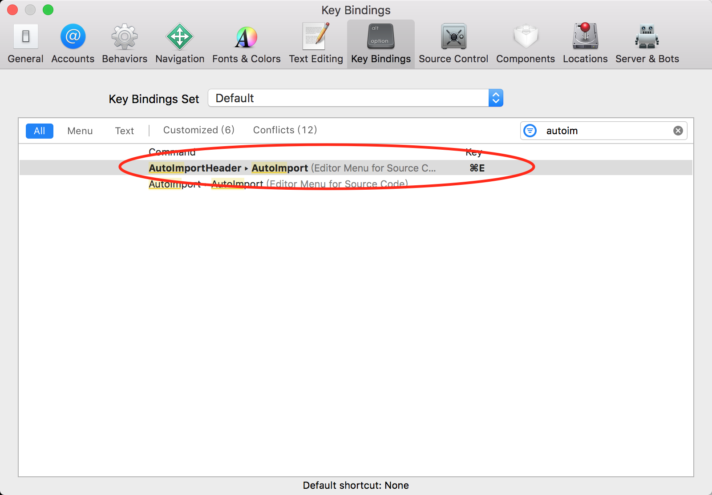
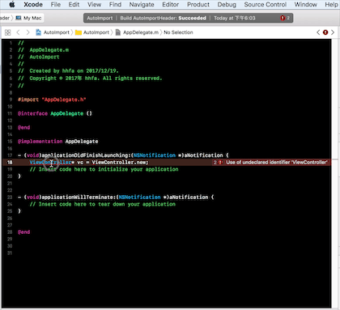

# AutoImport
AutoImport, handy Xcode plugin to import heaer file automatically.
Because sometimes you are on 999th line of code and scrolling up just to add an import is a waste of time. 

# Support
AutoImport is a Xcode Source Editor Extension, supports Xcode 8 and above.
Replacements of [Peckham](https://github.com/markohlebar/Peckham), as  decided to drop support for Xcode plugins in Xcode 8. 
## AutoImport by Menu

## AutoImport Key Binding

## AutoImport by Quick Key 

## Credits

I am using some helper functions to deal with the filtering out source text from[CleanHeaders-Xcode](https://github.com/insanoid/CleanHeaders-Xcode) and [xTextHandler-objc](https://github.com/cyanzhong/xTextHandler-objc), thanks for the awesome class.
